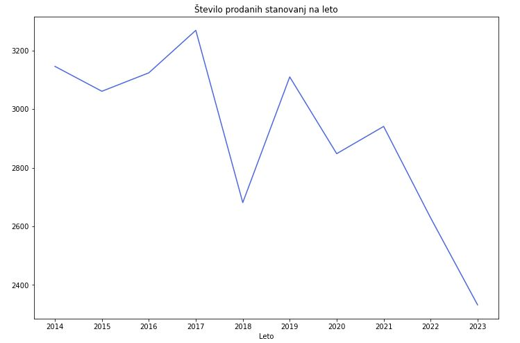
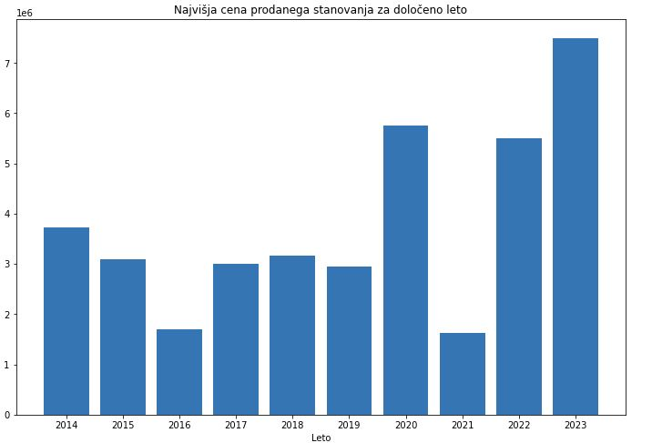
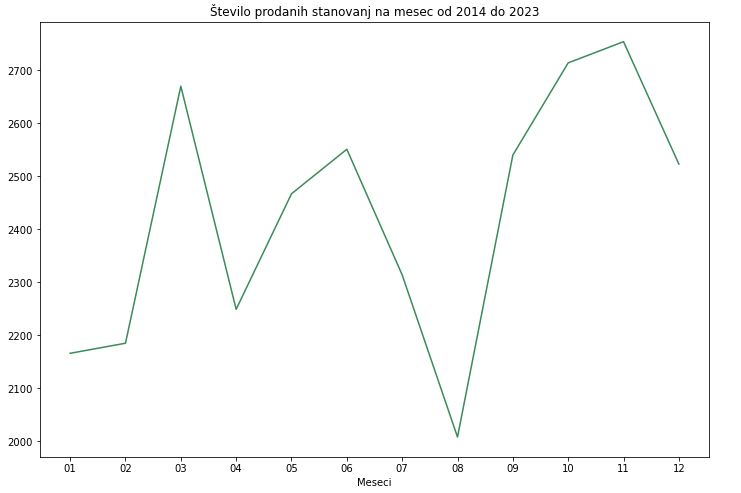

# Analiza stanovanjskega trga v Ljubljani
[https://ipi.eprostor.gov.si/jgp/data](https://ipi.eprostor.gov.si/jgp/data)

## OPIS PROBLEMA
Stanovanjski trg v Ljubljani je kompleksen in se nenehno spreminja. Cene stanovanj se razlikujejo glede na lokacijo, velikost in druge dejavnike. Cilj tega projekta je razumeti, kako se te cene spreminjajo in kaj vpliva na povpraševanje po stanovanjih v različnih delih mesta. S tem bomo lahko bolje razumeli trende na trgu in kaj bi to lahko pomenilo za ljudi, ki jih zanima nakup stanovanja.

## PODATKI
Za analizo stanovanjskega trga v Ljubljani potrebujemo določen par datotek (ETN_SLO_KUP_LETO_delistavb_20240302.csv in ETN_SLO_KUP_LETO_posli_20240302.csv). 
Preko »ID Posla«, ki je prisoten v obeh datotekah, lahko ugotovimo kater posel je bil kje sklenjen in za katero vrsto objekta gre (stanovanje). Po tem postopku lahko potem izluščimo vse stanovanjske objekte in posle, ki so se zgodili v Ljubljani.
Podatki v določenih primerih niso bili popolni, take primere sva odstranila iz končne množice podatkov.

Končna oblika obdelanih podatkov:
-	 #ID, #Ime ulice, #Hišna številka, #Leto izgradnje stanovanja, #Kvadratura stanovanja, #Datum prodaje, #Cena (EUR)

## GLAVNE UGOTOVITVE
### Število prodanih stanovanj po letih

V Ljubljani je bilo, v zadnjih desetih letih, najmanj stanovanj prodano leta 2018 in 2023.

```python
podatki_za_leto = [final2014,final2015,final2016,final2017,final2018,final2019,final2020,final2021,final2022,final2023]
stevilo_prodaj_po_letih = []
leto = 2014

for leto_analize in podatki_za_leto:
    stevilo_prodaj_po_letih.append([leto,len(leto_analize)])
    leto += 1;
```
 

### Najvišja cena prodanega stanovanja
```python
max_cena_za_vsako_leto = []

for leto_analize in podatki_za_leto:
    max_cena_za_vsako_leto.append(np.max(leto_analize[:, 6].astype(int)))
```

Čeprav je bilo v Ljubljani najmanj stanovanj prodano leta 2023, je bilo v tem letu eno stanovanje prodano za največ denarja do sedaj, za kar 7,500,000€.



### Najmanj prodanih stanovanj po mesecih 
Avgust, januar in april so meseci, kadar ljudje kupijo najmanj stanovanj v Ljubljani. 

```python
mesec_stanovanja_leta = [["2014"], ["2015"], ["2016"],["2017"], ["2018"], ["2019"],["2020"], ["2021"], ["2022"], ["2023"]]
meseci = ["01", "02", "03", "04", "05", "06", "07", "08", "09", "10", "11", "12"]

stevec = 0

for leto_analize in podatki_za_leto:
    meseci_slovar = dict()

    # Init: mesec -> seznam z vrsticami za ta mesec
    for i in meseci:
        meseci_slovar[i] = 0
    
    # Število prodanih stanovanj v določenem mesecu
    for row in leto_analize:
        mesec = row[5].split(".")[1]
        meseci_slovar[mesec] += 1

    temp_arr = []

    for stevilo_prodanih_na_mesec in meseci_slovar.values():
        temp_arr.append(stevilo_prodanih_na_mesec)

    temp_arr = np.array(temp_arr)
    mesec_stanovanja_leta[stevec].append(temp_arr)
    stevec += 1

mesecno_stevilo_prodanih_vsa_leta = np.zeros(12)

for letni_podatki in mesec_stanovanja_leta:
    mesecne_vrednosti = letni_podatki[1]
    mesecno_stevilo_prodanih_vsa_leta += mesecne_vrednosti
```


